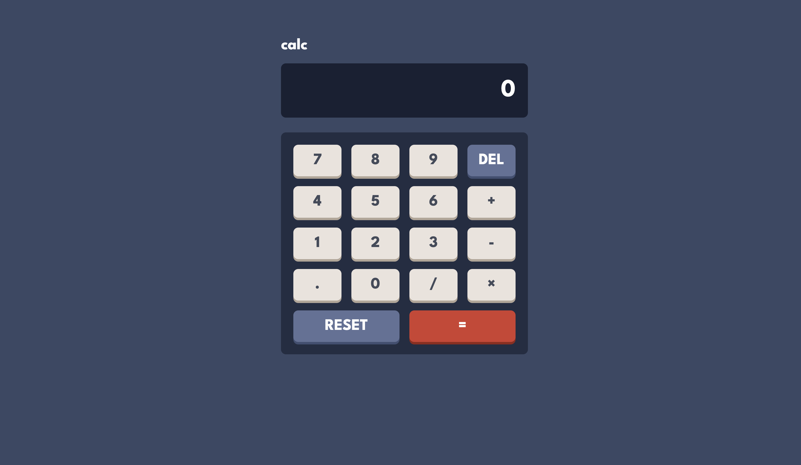

# Frontend Mentor - Calculator app solution

This is a solution to the [Calculator app challenge on Frontend Mentor](https://www.frontendmentor.io/challenges/calculator-app-9lteq5N29). Frontend Mentor challenges help you improve your coding skills by building realistic projects.

## Table of contents

- [Overview](#overview)
  - [The challenge](#the-challenge)
  - [Screenshot](#screenshot)
- [My process](#my-process)
  - [Built with](#built-with)
  - [What I learned](#what-i-learned)
  - [Continued development](#continued-development)
- [Author](#author)

## Overview

### The challenge

Users should be able to:

- See the size of the elements adjust based on their device's screen size
- Perform mathmatical operations like addition, subtraction, multiplication, and division
- Adjust the color theme based on their preference
- **Bonus**: Have their initial theme preference checked using `prefers-color-scheme` and have any additional changes saved in the browser

### Screenshot

## My process

To begin with, I built the static UI using HTML and CSS. This included implementing grid display to have the keys show up correctly. I then made the calculator functioning using vanilla JS to allow the user to press numbers, perform various operations, and reset/delete.

### Built with

- Semantic HTML5 markup
- Flexbox
- CSS Grid

### What I learned

I had not had much exposure to CSS Grid prior to this project, previously relying on Flexbox. I have now learnt how to set up a component that uses display, including constructing the template for the grids and columns and defining each element in the grid to be placed as desired.

### Continued development

I would like to continue to learn about grid, particularly more advanced layouts that are not simple grids like the keyboard in this project. I also intend to expand on this project in the near future, implementing the themes and making the decimal point functional (these features have not yet been added).

## Author

- Website - [Add your name here](https://github.com/SidhraFernando-Plant)
- Frontend Mentor - [@yourusername](https://www.frontendmentor.io/profile/SidhraFernando-Plant)
